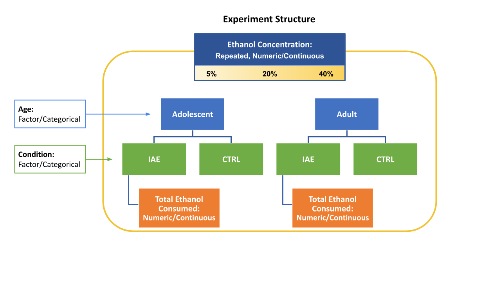
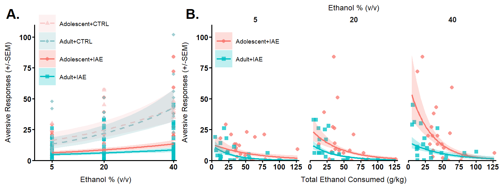

```{r setup, include = F}
knitr::opts_chunk$set(echo = T,
                      #results = "hide",
                      error = F,
                      warning = F,
                      message = F,
                      eval = T)
```

# Background

These data are from [Wukitsch & Cain, 2021](10.1007/s00213-021-05805-y) and are used here as an example of how to use `ggplot2` to graph Generalized Linear Mixed Effects Models using R. In this case, we have count data so we will use a Poisson model. The `ggplot2` library along with a few others, were used to produce the images in the aforementioned publication. Below is a comprehensive guide on how you can make ones like it for your glmer models too!

## Understanding the Data



These data originate from a portion of the study that had 2 independent (output) variables: Total Aversive Responses & Total Hedonic Responses. These variables are counts of the number of behaviors emitted in response to an orally infused fluid and are the behavioral results of the Taste Reactivity Test. Prior to undergoing Taste Reactivity testing, adult and adolescent Long-Evans rats were allowed Intermittent (voluntary) Access to drink Ethanol (IAE) Monday, Wednesday, and Friday. The amount and pattern of drinking over time during IAE were dependent (predictor) variables in some of our models in addition to their Age group. Control animals received only water during IAE and were not exposed to ethanol until Taste Reactivity testing. During Taste Reactivity testing, 3 substances were orally infused: Water on the first and last day of Taste Reactivity testing, Ethanol (at 5, 20, and 40% v/v concentrations), and Sucrose (at .01, .1, and 1 molar concentrations). We will focus on the Ethanol data here and want to treat all variables as they are... No categorizing our numeric continua into factors. This yields the following set of variables for our models:

**Independent (Outcome) Variables:**

* Total Aversive Responses (count data)
* Total Hedonic Responses (count data)


**Dependent (Predictor) Variables:**

+ **Age** (during IAE period)
  + Adult
  + Adolescent
+ Intermittent Ethanol Access (IAE) **Condition**
  + IAE (Had access to ethanol during IAE period)
    + **Ethanol Consumption** during IAE period *(A NESTED VARIABLE)*
  + CTRL (Did not have access to ethanol prior to Taste Reactivity Testing)
+ **Concentration** of Ethanol
  + 5%
  + 20%
  + 40%

## Modeling Approach

This nested data structure leaves us with some options. We can either 1. use a nested model or 2. perform two separate analyses of the same data that answer different questions. It all depends on your audience. We decided it was better for our audience to keep it straightforward and use the two analysis approach. The first model will answer questions about overall differences between our IAE and our CTRL groups, Age, and Concentration. The second will be able to answer questions about individual differences in ethanol consumption during IAE and how those may interact with Age and Concentration to alter taste reactivity. Thus, the formulas for our `glmer` models are as follows:

**Overall Models**

+ **Independent (AKA Predicted AKA Outcome) Variables**
  + Total Aversive Responses
  + Total Hedonic Responses
+ **Fixed Effect (AKA Main Effect) Variables (Full Factorial)**
  + Concentration
  + Age
  + Condition
+ **Random Effect Variables**
  + Intercept (RatID)
  + (Slope of) Concentration


This yields the following conceptual formulas for the Overall models:

+ $Aversive~Responses = exp(Age * Condition * Concentration + (Concentration | RatID))$
+ $Hedonic~Responses = exp(Age * Condition * Concentration + (Concentration | RatID))$

**Ethanol Consumption Models**

We haven't yet determined which measure of ethanol consumption to use for the Ethanol Consumption Models. We could use the sum total of all ethanol consumed during IAE (Total Ethanol), or we could use the intercept (Mean Alcohol Consumed; MAC) and slope of a line that best fits each individual's drinking during IAE across time (Rate of Change; RoC). We used `lmers` to calculate these values, but that is beyond the scope of the present example. A quirk of adolescent drinking during IAE was also of interest. Adolescents had very high drinking on the first day. This created some non-monotonicity (non-linearity) in our data, so, we wondered if removing the first day would impact the RoC substantially. Thus, we had an additional model that did not include the first day of drinking when calculating RoC and MAC (RoC3 and MAC3, respectively). Our plan was to compare the models predicting responses to orally infused ethanol and use the model with the best (lowest) AIC/BIC scores for interpretation.

+ **Independent (AKA Predicted AKA Outcome) Variables**
  + Total Aversive Responses
  + Total Hedonic Responses
+ **Fixed Effect (AKA Main Effect) Variables (Full Factorial where appropriate)**
  + Concentration
  + Age
  + Ethanol Consumption
    + Total Ethanol Consumed (grams ethanol/kg bodyweight; during IAE)
    + MAC & RoC (Consumption Pattern during IAE)
    + MAC3 & RoC3 (Consumption Pattern starting at day 3 [the second day of drinking])
+ **Random Effect Variables**
  + Intercept (RatID)
  + (Slope of) Concentration

This yields the following conceptual formulas for the Ethanol Consumption models:

+ Aversive Responses
  + $Aversive~Responses = exp(Concentration * Age * TotalEthanolConsumed  + (Concentration | RatID))$
  + $Aversive~Responses = exp(Concentration * Age * [MAC + RoC] + (Concentration | RatID))$
  + $Aversive~Responses = exp(Concentration * Age * [MAC3 + RoC3] + (Concentration | RatID))$
+ Hedonic Responses
  + $Hedonic~Responses = exp(Concentration * Age * TotalEthanolConsumed  + (Concentration | RatID))$
  + $Hedonic~Responses = exp(Concentration * Age * [MAC + RoC] + (Concentration | RatID))$
  + $Hedonic~Responses = exp(Concentration * Age * [MAC3 + RoC3] + (Concentration | RatID))$
  
*Note: the brackets '[]' are intended to indicate that MAC and RoC (and MAC3 and RoC3) do not interact with each other in the models above. This will become clearer when we specify the formula in long-form within the coding for the model in a later step.*

# Coding Approach Goals

Now that we understand our data and our modeling approach, we need to consider our order of operations and goals for our data. We want an organized workspace that we can come back to and modify if needs change or if we have additional questions. We want to organize our models and any additional analyses into smaller sets of code, so we can more easily navigate and troubleshoot. And, finally, we want to have some pretty graphs that get our point across and clearly represent the data well. This gives us 4 goals...

**GOALS:** 

1. Organize and Setup Data Workspace & Structures
2. Model Data (Generalized Linear Mixed Effects Models) & Organize Output Objects
3. Perform Comparisons, Obtain Trend Info., & Organize Output objects
4. Create Publication-Quality Nested Multi-panel Graphs with `ggplot2` & Organize Output objects


# 1. Workspace Setup

## Install and Load Required Packages

If you haven't already downloaded and installed Rtools, please install [`Rtools`](https://cran.r-project.org/bin/windows/Rtools/) and restart R. The C++ compiler is required for some of the packages that you are about to install. 

The following code will check and remind you if you haven't yet installed Rtools. Then it will check to see if the package is already downloaded and installed. If so, it will load the package. If not, it will install the package from CRAN and then load the package once the installation is complete. You may be prompted to allow some of the downloads to take place so please remain at your device. I recommend making a separate R script like this for every project. As you add packages that you need, be sure to add them to your setup script and save time and guess work. 

```{r load packages, results = "hide"}
# Load Packages ####

# See if rtools is installed. It has necessary C++ compiler for installs of some of the libraries that are required.
if (Sys.which("make") == "") {  # Check to see if "make" command from rtools is found in system's PATH. If an empty string is retuned, rtools isn't installed.
  message("Rtools is not found. Please install Rtools from https://cran.r-project.org/bin/windows/Rtools/ and restart R.")
} else { #rtools installed == TRUE
  message("Rtools is installed.")
  
  # Load package or install MASS and load if not present
  if (!require(MASS)) {
    install.packages("MASS")
    library(MASS)
  }
  
  # Load package or install lattice and load if not present
  if (!require(lattice)) {
    install.packages("lattice")
    library(lattice)
  }
  
  # Load package or install boot and load if not present
  if (!require(boot)) {
    install.packages("boot")
    library(boot)
  }
  
  # Load package or install car and load if not present
  if (!require(car)) {
    install.packages("car")
    library(car)
  }
  
  # Load package or install emmeans and load if not present
  if (!require(emmeans)) {
    install.packages("emmeans")
    library(emmeans)
  }
  
  
  # Load package or install lme4 and load if not present
  if (!require(lme4)) {
    install.packages("lme4")
    library(lme4)
  }
  
  # Load package or install zoo and load if not present
  if (!require(zoo)) {
    install.packages("zoo")
    library(zoo)
  }
  
  # Load package or install tidyr and load if not present
  if (!require(tidyr)) {
    install.packages("tidyr")
    library(tidyr)
  }
  
  # Load package or install ggplot2 and load if not present
  if (!require(ggplot2)) {
    install.packages("ggplot2")
    library(ggplot2)
  }
  
  # Load package or install lmerTest and load if not present
  if (!require(lmerTest)) {
    install.packages("lmerTest")
    library(lmerTest)
  }
  
  # Load package or install dplyr and load if not present
  if (!require(dplyr)) {
    install.packages("dplyr")
    library(dplyr)
  }
  
  # Load package or install multcomp and load if not present
  if (!require(multcomp)) {
    install.packages("multcomp")
    library(multcomp)
  }
  
  # Load package or install foreign and load if not present
  if (!require(foreign)) {
    install.packages("foreign")
    library(foreign)
  }
  
  # Load package or install msm and load if not present
  if (!require(msm)) {
    install.packages("msm")
    library(msm)
  }
  
  # Load package or install effects and load if not present
  if (!require(effects)) {
    install.packages("effects")
    library(effects)
  }
  
    # Load package or install effects and load if not present
  if (!require(gridExtra)) {
    install.packages("gridExtra")
    library(gridExtra)
  }

  # Load package or install patchwork and load if not present
  if (!require(patchwork)) {
    install.packages("patchwork")
    library(patchwork)
  }

} # end rtools installed == TRUE
```

## Set your working directory

Using a working directory allows for relative referencing as opposed to absolute (aka static) referencing. Instead of changing every single absolute reference to a folder on one computer throughout all your code, you just need to change the working directory at the beginning and load/save from there. For example, say I want to reference the Experimental Structure.png from above. Instead of an absolute reference path like "C:/Users/name/Documents/ABHV/README_files/Experimental Structure.png", a relative reference path would be "README_files/Experimental Structure.png" Because our working directory is already set to the ABHV folder that contains the README_files folder, we dont need the extra fluff. This results in code that not only saves time because it is shorter, but is much more flexible for a variety of situations like using the code on another computer. Always try to use relative referencing once you have changed your working directory to make your life (and anyone's life that you share you code with) much easier.

```{r Working Directory, results = "hide"}
# Set your working directory to your project folder and check that it is correct. 
setwd("C:/Users/kieri/Documents/ABHV")
getwd()
```

## Workspace Overview

To keep an organized and uncluttered workspace, I use sets of hierarchical lists to store related objects.
We have the following object categories with most analyses:

+ data
+ models
+ comparisons (abbv. "compars")
+ plots

In this specific set of analyses we have a number of needs that determine the objects in each category.

### Data Storage

The full data requires various sub-setting to ensure the correct substances are being assessed independently. For example, we want to make sure that controls that never received access to ethanol are not included in an analysis or mean calculation when it would be inappropriate to do so. Thus, my data list object will look like this (with abbreviated names for easier calling in the code itself):

+ Data
  + Raw
  + Ethanol
    + With Controls
    + No Controls
  + Sucrose
    + With Controls
    + No Controls
  + water
    + With Controls
    + No Controls

To do this we generate a list called `data` and begin populating it with subsets of the original data. In the process, it will be easier to make some changes now because subsets of data inherit certain attributes from their parent data sets. Therefore, during this step, we will also adjust the contrast coding and scale of some of our variables to help us avoid problems later. We adjust our categorical (factor) variables' contrast coding attribute because we want our `glmer` models' categorical variables to be coded like an ANOVA to ease interpretation of the effects. In other words, we want our model's intercept to be at the Grand Mean. This is just a personal preference of mine because I am used to it. This requires us to recode our categorical variables using sum-to-zero aka contrast coding instead of dummy coding or other types. Briefly, one group is assigned +1 and the other is assigned -1 and they sum to zero.

```{r Data Subsetting, results = "hide"}
# Create our main data object
ABHVdata <- list()

    # Read in data file 
    ABHVdata$raw <- read.csv("ABHV2018.csv",
                         na.strings="\"\"", #with blanks/ N/As set to blank ("\"\"")
                         stringsAsFactors = TRUE) # categorical/character data as "factor"
    ABHVdata$raw$RatID <- as.factor(ABHVdata$raw$RatID) # Convert RatID to factor type because it is not a numeric variable although it seems like one.
      
    # Change to Contrast Sum Coding (sum-to-zero). 
      # This attribute will be inherited for all data frames subset from this one,
      # so it is a good idea to perform this step now, instead of many times later.
    
      # adjust Age to contrast coding
      contrasts(ABHVdata$raw$Age)=contr.sum(2)
      contrasts(ABHVdata$raw$Age)
      # adjust Condition to contrast coding
      contrasts(ABHVdata$raw$Condition)=contr.sum(2)
      contrasts(ABHVdata$raw$Condition)
      
        
  ## Subset Ethanol Data ####
      
    # With Controls
    ABHVdata$eth$ctrl <- subset(ABHVdata$raw, Substance == "Ethanol")
        # Rescale to avoid issues with eigen values later
        ABHVdata$eth$ctrl$recoded.conc <- car::recode(ABHVdata$eth$ctrl$Concentration, "5 =.05; 20 =.20; 40 =.40")
      
    # No Controls
      # Subset rats that could drink ethanol from rats that never had the opportunity
      ABHVdata$eth$no.ctrl <- subset(ABHVdata$eth$ctrl, Condition != "CTRL")
    
    # Uncomment the 2 lines below to view your data frames in RStudio
    #View(ABHVdata$eth$ctrl)
    #View(ABHVdata$eth$no.ctrl)
    
  ## Subset Sucrose Data ####
    # With Controls
    ABHVdata$suc$ctrl <- subset(ABHVdata$raw, Substance == "Sucrose")
      # Rescale -- to avoid issues with eigen values later
      ABHVdata$suc$ctrl$molarity <- car::recode(ABHVdata$suc$ctrl$Concentration, ".34=.01; 3.4=.1; 34=1")
    
    # No Controls
      # Subset rats that could drink ethanol from rats that never had the opportunity
    ABHVdata$suc$no.ctrl <- subset(ABHVdata$suc$ctrl, Condition != "CTRL")
    
    #Uncomment the 2 lines below to view your data frames in RStudio
    #View(ABHVdata$suc$ctrl)
    #View(ABHVdata$suc$no.ctrl)
  
  ## Subset Water Data ####
    # With Controls
    ABHVdata$h2o$ctrl <- subset(ABHVdata$raw, Substance == "Water1" | Substance == "Water2")
      # Get rid of the 4 levels of Substance inherited from the original dataset
      ABHVdata$h2o$ctrl$Substance <- factor(ABHVdata$h2o$ctrl$Substance)
      # Recode this for clarity and easy use as a label in future graphs
      ABHVdata$h2o$ctrl$trial <- dplyr::recode(ABHVdata$h2o$ctrl$Substance,
                                          "Water1" = "Trial 1",
                                          "Water2" = "Trial 2")
      # Adjust contrasts to sum-to-zero now that there are 2 factors
      contrasts(ABHVdata$h2o$ctrl$Substance)=contr.sum(2)
      contrasts(ABHVdata$h2o$ctrl$Substance)

      
    # No Controls
      # Subset rats that could drink ethanol from rats that never had the opportunity
    ABHVdata$h2o$no.ctrl <- subset(ABHVdata$h2o$ctrl, Condition != "CTRL")      
    
    #Uncomment the 2 lines below to view your data frames in RStudio
    #View(ABHVdata$h2o$ctrl)
    #View(ABHVdata$h2o$no.ctrl)
```

Now we have our data list object with the following hierarchical structure:

* `ABHVdata`
  * `ABHVdata$raw`
  * `ABHVdata$eth`
    * `ABHVdata$eth$ctrl`
    * `ABHVdata$eth$no.ctrl`
  * `ABHVdata$suc`
    * `ABHVdata$suc$ctrl`
    * `ABHVdata$suc$no.ctrl`
  * `ABHVdata$h2o`
    * `ABHVdata$h2o$ctrl`
    * `ABHVdata$h2o$no.ctrl`

And we have also performed our coding adjustments. However, we still need to further prepare our data to avoid issues during analysis such as problems with variance inflation. If we mean-center the continuous variables that will be predictors in an `lmer` or `glmer` model, the variance inflation factor tends to remain within a tolerable range and shouldn't affect results. Thus we mean-center the variables we need to below and save our workspace, so we can come back to this point later if we mess something up.

```{r Centering Variables, results = "hide"}
  ## Mean Centering Variables ####
    
    # Ethanol
      # center Concentration to avoid issues with variance inflation factor (VIF) tolerances
      ABHVdata$eth$ctrl$c.conc <- ABHVdata$eth$ctrl$recoded.conc - mean(ABHVdata$eth$ctrl$recoded.conc)
      # center TOTAL.ETOH.Swap.Consumed..g.kg.
      ABHVdata$eth$no.ctrl$c.totale <- ABHVdata$eth$no.ctrl$TOTAL.ETOH.Swap.Consumed..g.kg. - mean(ABHVdata$eth$no.ctrl$TOTAL.ETOH.Swap.Consumed..g.kg.)
      # center Concentration 
      ABHVdata$eth$no.ctrl$c.conc <- ABHVdata$eth$no.ctrl$recoded.conc - mean(ABHVdata$eth$no.ctrl$recoded.conc)
      
      # center MAC and ROC
      ABHVdata$eth$no.ctrl$c.MAC <- ABHVdata$eth$no.ctrl$MAC - mean(ABHVdata$eth$no.ctrl$MAC)
      ABHVdata$eth$no.ctrl$c.ROC <- ABHVdata$eth$no.ctrl$ROC - mean(ABHVdata$eth$no.ctrl$ROC)
      ABHVdata$eth$no.ctrl$c.MAC3 <- ABHVdata$eth$no.ctrl$MAC3 - mean(ABHVdata$eth$no.ctrl$MAC3)
      ABHVdata$eth$no.ctrl$c.ROC3 <- ABHVdata$eth$no.ctrl$ROC3 - mean(ABHVdata$eth$no.ctrl$ROC3)
    
    
    # Sucrose
      # Center molarity
      ABHVdata$suc$ctrl$c.molarity <- ABHVdata$suc$ctrl$molarity - mean(ABHVdata$suc$ctrl$molarity)
      ABHVdata$suc$no.ctrl$c.molarity <- ABHVdata$suc$no.ctrl$molarity - mean(ABHVdata$suc$no.ctrl$molarity)
      # center TOTAL.ETOH.Swap.Consumed..g.kg.
      ABHVdata$suc$no.ctrl$c.totale <- ABHVdata$suc$no.ctrl$TOTAL.ETOH.Swap.Consumed..g.kg. - mean(ABHVdata$suc$no.ctrl$TOTAL.ETOH.Swap.Consumed..g.kg.)
    
    
    # Water
      # center TOTAL.ETOH.Swap.Consumed..g.kg.
      ABHVdata$h2o$no.ctrl$c.totale <- ABHVdata$h2o$no.ctrl$TOTAL.ETOH.Swap.Consumed..g.kg. - mean(ABHVdata$h2o$no.ctrl$TOTAL.ETOH.Swap.Consumed..g.kg.)
    
    # Save the workspace
    save.image("ABHV_workspace.RData")

```

### Model and Comparison Storage

**Model Data**

To accommodate and store each list object returned by our models, we need another hierarchical list object (`models`) with a similar structure to the data above. However, there is more nuance because we are performing analyses for hedonic and aversive responses and, for each of those, we have analyses that involve different variables (Overall Model, Total Ethanol, MR, and MR3). So we will need a slightly different list structure that accommodates each formula we discussed in the background section above. And, since we are comparing models based on their ability to predict reactions to the substance of most interest to us (Ethanol), we will have less analyses for Sucrose and Water. In the end it should look something like this:

+ Models
  + Ethanol
    + Aversive
      + Overall
      + Total Ethanol
      + Mean Alcohol Consumed & Rate of Change
      + Mean Alcohol Consumed & Rate of Change excluding day 3
    + Hedonic
      + Overall
      + Total Ethanol
      + Mean Alcohol Consumed & Rate of Change
      + Mean Alcohol Consumed & Rate of Change excluding day 3
  + Sucrose
    + Aversive
      + Overall
      + Total Ethanol
    + Hedonic
      + Overall
      + Total Ethanol
  + Water
    + Aversive
      + Overall
      + Total Ethanol
    + Hedonic
      + Overall
      + Total Ethanol
      
**Comparison Data**

Our comparison data will look a bit different. The overall structure of our comparison list object (`compars`) will be the same as the models; however, we won't need to make comparisons for variables that aren't significant. Therefore, we will just have objects in `compars` based on the analysis they came from and the name of the fixed effect/interaction they are from. For example, the structure might look something like:

+ Comparisons
  + Ethanol
    + Aversive
      + Overall
        + Condition
      + Total Ethanol
        + Age
        + Age*Concentration (interaction)

We will discuss the organization of `plots` and related variables when we reach that portion so it makes more sense. But we will need our `models` and `compars` lists for the next steps, so lets make those now.

```{r Model and Planned Comparison Lists, results = "hide"}
# List setup ####

## Models ####
models <- list()

## Comparisons ####
compars <- list()

```

# 2. & 3. Modeling & Comparisons

To quickly recap: This is count data that has some missing data due to attrition. It also has a continuous predictor variable that represents our repeated measure (Concentration) since each animal reacted to each concentration of each substance. Therefore, a Poisson Generalized Linear Mixed Effects Regression (glmer with a Poisson link function) is appropriate for analysis because it can handle these issues/needs much better than a lot of other models. As discussed before, there is some nesting in the structure of the data. For the audience of the publication, we opted to do two separate analyses on this data set instead of properly nesting it. We are using ethanol as an illustrative example because it also has two models that I wanted to compare and they demonstrate different `glmer` formula configurations well.

For convenience, I will restate our variables:

**Independent (Outcome) Variables:**

* Total Aversive Responses (count data)
* Total Hedonic Responses (count data)


**Dependent (Predictor) Variables:**

+ **Age** (during IAE period)
  + Adult
  + Adolescent
+ Intermittent Ethanol Access (IAE) **Condition**
  + IAE (Had access to ethanol during IAE period)
    + **Ethanol Consumption** during IAE period *(A NESTED VARIABLE)*
  + CTRL (Did not have access to ethanol prior to Taste Reactivity Testing)
+ **Concentration** of Ethanol
  + 5%
  + 20%
  + 40%

Now that we have our variables and our storage objects ready to go, we can begin running our models. Remember that our continuous variables will be centered variables (e.g. `c.conc` for Concentration)

## Ethanol Aversive Responses

### Overall Model

```{r Aversive Responses: Overall Model}
# Ethanol vs Control (Overall)

  ## Ethanol Aversives GLMER (with EtOH vs CTRL)####
    models$eth$avers$overall <- glmer(Total.Aversive ~ c.conc*Age*Condition # predictors: full factorial fixed effects of centered concentration, age, and condition
                                      + (c.conc|RatID), # and the random effects of the intercept (RatID) and the slope of concentration
                                      data = ABHVdata$eth$ctrl,
                                      family = poisson)
    # Get a summary of our output
    summary(models$eth$avers$overall)
```

Now we need to check to see if our assumption of normally distributed residuals is correct using a simple plot.

```{r Aversive Responses: Overall Model Residual Normality Check, echo = TRUE}
    # plot residual density function
    plot(density(residuals(models$eth$avers$overall)), 
         main = "",
         xlab = "", 
         frame = FALSE)
    # Add normal distribution to the residual plot for comparison to check assumption of normality
    MEAN = mean(residuals(models$eth$avers$overall))
    STDEV = sqrt(var(residuals(models$eth$avers$overall)))
    curve(dnorm(x, mean = MEAN, sd = STDEV),
          col = "darkblue",
          lwd = 2,
          add = TRUE,
          yaxt = "n") # Generate normal curve
    remove(MEAN, STDEV) # Clean workspace

```

The blue line is a normal distribution. The black line is our residual distribution. From the graph we can see the residuals are slighly kurtotic (pointier and a bit thinner than a normal curve), but mostly normal. I would say that the assumption of normality has been met. 

Now, on to interpretation. We have our summary from before, but we need to compare our significant variables. `emmeans` is a convenient package for this. I can look at the means from the model and compare my two levels of my Condition variable to see which direction the difference is in and how large the difference between means is. When your categorical variables have 3 or more levels, *post hoc* comparisons that control for familywise error rate are available using the `pairs()` function from the `emmeans` library.

```{r Aversive Responses: Overall Model Planned Comparisons}
  # Compare significant variables
  compars$eth$avers$overall$condition <- emmeans(models$eth$avers$overall, ~ Condition) # Perform comparison of Condition with emmeans
  
  # We dont need a comparison from c.conc because we have a direction AND a magnitude on a continuous variable! WOO!
  
  summary(compars$eth$avers$overall$condition, type = "response") # get summary in the numerical space of the original variable not the log/Poisson space
  
  #Save Workspace
  save.image("ABHV_workspace.RData")

```

We document these numbers, save our workspace and then move on to the next model.

### Total Ethanol Consumed

Next we run our Total Ethanol Consumed model. However, this model will have some problems with convergence, so we will need to update from where the model left off and use the optimizer controls to extend the number of iterations the model uses to find convergence.

```{r Aversive Responses: Total Ethanol, warning = T, error = T, message = T}
# predictors: full factorial fixed effects of centered concentration, age, and total ethanol consumed during drinking phase of study
models$eth$avers$total.e <- glmer(Total.Aversive ~ c.conc*Age*c.totale 
                                  + (c.conc|RatID), # and the random effects of the intercept (RatID) and the slope of concentration
                                  data = ABHVdata$eth$no.ctrl,
                                  family = poisson)
```
  
```{r Extend Model Iterations}  
  # Model did not converge. Grab Theta and fixed effects data from model and put into temporary object
  ss <- getME(models$eth$avers$total.e,c("theta", "fixef"))
  # Extend the number of iterations with optimizer and update model
  models$eth$avers$total.e <- update(models$eth$avers$total.e,
                                     start = ss,
                                     control = glmerControl(optCtrl = list(maxfun = 2e6))) 
```
```{r Get Model Summary}
  # Model converged, get summary of output
  summary(models$eth$avers$total.e)
  
  remove(ss) # Remove temporary object to declutter workspace
```

Again, before we begin interpreting, we need to check to see if our assumption of normally distributed residuals is correct using a plot of probability density.

```{r Aversive Responses: Total Ethanol Residual Normality Check, echo = FALSE}
    # plot residual density function
    plot(density(residuals(models$eth$avers$total.e)), 
         main = "",
         xlab = "", 
         frame = FALSE) 
    # Add normal distribution to the residual plot for comparison to check assumption of normality
    MEAN = mean(residuals(models$eth$avers$total.e))
    STDEV = sqrt(var(residuals(models$eth$avers$total.e)))
    curve(dnorm(x, mean = MEAN, sd = STDEV),
          col = "darkblue",
          lwd = 2,
          add = TRUE,
          yaxt = "n") # Generate normal curve
    remove(MEAN, STDEV) # Clean workspace
```

Again, the blue line is a normal distribution. The black line is our residual distribution. From the graph we can see the residuals are, again, slightly kurtotic but mostly normal. I would say that the assumption of normality has been met here as well. 

On to interpretation. We need to look at the means from the model and compare the two levels of our Age variable to see which direction and how large the difference is. Copy down the data we need, save, rinse, and repeat...

```{r Aversive Responses: Total Ethanol Planned Comparisons}
    # Compare significant variables
    compars$eth$avers$total.e <- list() # Create new comparison list for total.e model
    compars$eth$avers$total.e$age <- emmeans(models$eth$avers$total.e, ~ Age) # Perform comparison of Condition with emmeans
    summary(compars$eth$avers$total.e$age, type = "response") # get summary in the numerical space of the original variable not the log/Poisson space
    
  #Save Workspace
  save.image("ABHV_workspace.RData")
```

### MAC & RoC (MR1)
    
```{r Aversive Responses: MAC and RoC (MR1), warning = T, error = T, message = T}
  # predictors: note that these are not the full factorial fixed effects. I'm not interested in the higher level interactions here.
models$eth$avers$MR1 <- glmer(Total.Aversive ~ c.conc+Age+c.MAC+c.ROC
                              + c.conc:Age
                              + c.conc:c.MAC
                              + c.conc:c.ROC
                              + Age:c.MAC
                              + Age:c.ROC
                              + c.conc:Age:c.MAC
                              + c.conc:Age:c.ROC
                              + (c.conc|RatID),
                              data = ABHVdata$eth$no.ctrl, 
                              family = poisson)

# Model did not converge, used code below to extend # of iterations and start from where the previous model left off.
ss <- getME(models$eth$avers$MR1,c("theta","fixef"))
models$eth$avers$MR1 <- update(models$eth$avers$MR1,
                               start = ss,
                               control = glmerControl(optCtrl = list(maxfun = 2e6)))

summary(models$eth$avers$MR1)
remove(ss) # Clean workspace

# Check variance inflation factor (VIF)
vif(models$eth$avers$MR1)

# Compare with the previous model
AIC(models$eth$avers$MR1, models$eth$avers$total.e)
BIC(models$eth$avers$MR1, models$eth$avers$total.e)

```

Again, check normality of residuals

```{r Aversive Responses: MAC and RoC (MR1) Residual Normality Check, echo = FALSE}
    # Start by plotting a density function of model's residuals
    plot(density(residuals(models$eth$avers$MR1)), 
         main = "", 
         xlab = "", 
         frame = FALSE)
     # Add normal distribution to the residual plot for comparison to check assumption of normality
     MEAN = mean(residuals(models$eth$avers$MR1)) # get the residual mean
     STDEV = sqrt(var(residuals(models$eth$avers$MR1))) # get the st dev
     curve(dnorm(x, mean = MEAN, sd = STDEV),
           col = "darkblue",
           lwd = 2,
           add = TRUE,
           yaxt = "n") # Generate normal curve
     remove(MEAN, STDEV) # Clean workspace

#Save Workspace
save.image("ABHV_workspace.RData")
```

Similar to previous residuals. No planned comparisons here. This model was not selected for interpretation (considerably higher BIC), so I didn't perform any. Then we repeat for the 4th model which excludes the first day of drinking from calculations of MAC and RoC.

### MAC3 and RoC3 (MR3)

```{r Aversive Responses: MAC and RoC (MR3)}
  # predictors: note that these are not the full factorial fixed effects. I'm not interested in the higher level interactions here.
models$eth$avers$MR3 <- glmer(Total.Aversive ~ c.conc+Age+c.MAC3+c.ROC3
                              + c.conc:Age
                              + c.conc:c.MAC3
                              + c.conc:c.ROC3
                              + Age:c.MAC3
                              + Age:c.ROC3
                              + c.conc:Age:c.MAC3
                              + c.conc:Age:c.ROC3
                              + (c.conc|RatID),
                              data = ABHVdata$eth$no.ctrl,
                              family = poisson)

# Model did not converge, used code below to extend # of iterations and start from where the previous model left off.
  ss <- getME(models$eth$avers$MR3, c("theta","fixef"))
  models$eth$avers$MR3 <- update(models$eth$avers$MR3,
                                 start = ss,
                                 control = glmerControl(optCtrl = list(maxfun = 2e9)))
  remove(ss) # Clean workspace

summary(models$eth$avers$MR3)

# Variance inflation check & model comparison
  vif(models$eth$avers$MR3)
  AIC(models$eth$avers$MR3, models$eth$avers$MR1, models$eth$avers$total.e)
  BIC(models$eth$avers$MR3, models$eth$avers$MR1, models$eth$avers$total.e)
```

It looks like our Total Ethanol Consumed model is still doing the best in terms of BIC so we will use it for the remaining substances instead of MR1 or MR3.

Again, check normality of residuals

```{r Aversive Responses: MAC and RoC (MR3) Residual Normality Check, echo = FALSE}
    # Start by plotting a density function of model's residuals
    plot(density(residuals(models$eth$avers$MR3)), 
        main = "",
        xlab = "",
        frame = FALSE)
    # Add normal distribution to the residual plot for comparison to check assumption of normality
    MEAN = mean(residuals(models$eth$avers$MR3)) # get the residual mean
    STDEV = sqrt(var(residuals(models$eth$avers$MR3))) # get the st dev
    curve(dnorm(x, mean = MEAN, sd = STDEV),
          col = "darkblue",
          lwd = 2,
          add = TRUE,
          yaxt = "n") # Generate normal curve
    remove(MEAN, STDEV) # Clean workspace

#Save Workspace
save.image("ABHV_workspace.RData")
```

And again, things look pretty normal. The remaining Sucrose and Water model runs are not shown here for brevity.

# 4. Plotting/Graphing GLMERs with ggplot2

Before we jump into graphing, the next steps seem like a lot of info *because they are a lot of info*. It takes time with any new thing to become comfortable and you may feel you are drinking from a fire-hose at times. The flexibility of `ggplot2` is both its blessing and its curse. It has a steep learning curve, but is powerful because it can do pretty much whatever you want it to do for your graph. If you feel like you are drinking from a fire-hose as you go through the content below, I recommend finding a few beginners tutorials on `ggplot2`, especially if this is your first time using it. Practice using it with some simpler graphing first. The details we go into will start to make sense once you are more familiar with the syntax.

## Planning Our Graphs

***How do we want our graphs to look?***

This is the question we MUST answer before we start writing our first line of code. It is the key to our audience understanding our data. If you are unsure which way might look best, try a few options and talk to mentors or colleagues. Draw a small mock-up and see if the rough plan works, then see if it best tells the story of your data. The more perspectives you get, the better prepared you are to get a solid answer before making the graph into something worth publishing. That initial effort saves tons of time later. 

In our case, we have obvious Y-axis variables: `Hedonic` and `Aversive Responses`. However, our X-variable situation is less straightforward at first glance. In our 'Overall' analyses, we have 2 categorical variables (`Condition` & `Age`) and one continuous repeated measure variable (`Concentration`). Ergo, it makes sense to use `Concentration` as our X variable and show lines of change for each group across that axis in a single graph. Simple enough.

For the 'Total Ethanol' analyses, however, we have one categorical variable (`Age`) and 2 continuous variables (`Concentration` & `Total Ethanol Consumed`) which will require multiple graphs. In `ggplot2` we can make a graph with one shared Y-axis and multiple graphs that represent slices through one of the continuous variables to effectively create two X-axes. The questions are: which variable do we choose and where do we slice? We could go with a few graphs that slice `Total Ethanol Consumed` into ranges for example from 0-39.9, 40-79.9, and 80-120 g/kg of `Total Ethanol Consumed` and then for each range's graph show `Concentration` as the X-axis with our Y-variable averaged across all the individuals in those ranges at each concentration tested. However, in this case, we already have predefined slices in one of our variables because we sampled at set concentrations along a range of concentrations (5, 20, & 40%). It makes sense to use these predetermined `Concentration` slices as the points that determine our graph slices and our `Total Ethanol Consumed` variable as our X-axis. This is sensical for at least 2 reasons: 1. It will cut the slices at a point where a high amount of measurement occurred along the `Concentration` continuum rendering those values very likely to be accurate, and 2. it will better capture the rich variability that is present in our `Total Ethanol Consumed` variable. 

We will go with the latter of the options: `Concentration` as the X-variable that is sliced to produce multiple graph panels of Responses vs `Total Ethanol Consumed`. To ease comparison between the two analyses, we will show the 'Overall' data and the 'Total Ethanol' data side by side with the same Y-axis specifications. This means we need a nested multi-panel graph. Panel A. will show the graph of the 'Overall' analysis, while panel B. will show the multi-panel graph of the 'Total Ethanol' analysis.

## Testing and Organizing

Now that we know what we want our graphs to look like, we need to keep the aesthetic variables associated with them easy to change and we need an organized structure to store these variables along with the graphs themselves. If we only needed to make one graph, there would be no real point in assigning values to objects to use for argument values in our ggplot code. We'd simply change them directly in the code and be sure to have a nice organized list object for storing the plots. However, since we are making multiple sets of these graphs (6 to be exact), we want them to share aesthetic elements that we don't want to have to change manually for each graph each time we make a change. Thus, we need to integrate our hierarchical organization of our plots into a list object with our organization of our variables related to those plots. But how do we know which elements of our graph code we need variables for? The answer is iterative.

### Graph Setup

First, we need to get our model's predictions into some form of data that we can use for our graph. Our `xlevels` are points on the graph that each function as a joint or pivot point for the sets of lines that will make up our curved trend lines and error ribbons. The more points you have, the curvier your curves look. They are made from a sequence along your x-axis(es) that you determine in advance. For our 'Overall' models, we are making a sequence for `Concentration` from .05 to .40 by 0.025 increments resulting in 15 points for our curve. This should be plenty curvy enough. We also have to mean-center these points so they align with the data that our model used. Then we "uncenter" them so our graphs are in our original units and show trends at our tested values.

```{r Effects Data Frame: OVerall}
# Create list for storage
plots <- list()


        # Mean center xlevel graphing points 
        plots$eth$x.axis$overall$xlvls <- seq(.05, .40, .025) - mean(ABHVdata$eth$ctrl$recoded.conc) # the points along the curve you want to use to get good error ribbons.
        
        # Pull the effects from model & calculate confidence intervals for graphing
        plots$eth$avers$overall$fx <- Effect(c("c.conc", "Age", "Condition"),
                                        models$eth$avers$overall,
                                        se = list(level = .68), # se is std err and the level is the confidence level. .68 = actual std err for conf int. lower and upper.
                                        xlevels = list(c.conc = plots$eth$x.axis$overall$xlvls))# the xlevels command is used to increase the number of points calculated for the total ethanol (default = 5)
        
        # Convert effect object to data frame
        plots$eth$avers$overall$fx <- as.data.frame(plots$eth$avers$overall$fx)
        # Get original Concentration values (un-center the variable)
        plots$eth$avers$overall$fx$Concentration <- (plots$eth$avers$overall$fx$c.conc + mean(ABHVdata$eth$ctrl$recoded.conc)) * 100
        # Check that everything went smoothly, look at your new data frame
        plots$eth$avers$overall$fx

```

Then we do the same thing for our 'Total Ethanol' graph data, however, we have 2 x-variables, so we need to make sure we get the right number of levels of each variable. `Concentration` is pretty easy: we have 3 slices we want to take at each of our measured values (.05, .20, & .40), so we use those values. Thankfully, `Total Ethanol Consumed` is also pretty easy. Instead of assigning specific values, we can tell the effects function to calculate 20 values that are evenly distributed across the range of that variable by just using '= 20'.

```{r Effects Data Frame: Total Ethanol}
# Mean center xlevel graphing points for ALL of Ethanol's, Total Ethanol graphs
        plots$eth$x.axis$total.e$xlvls <- c(.05, .20, .40) - mean(ABHVdata$eth$no.ctrl$recoded.conc) # the points along the curve you want to use to get good error ribbons.
        
        # Pull the effects from model & calculate confidence intervals for graphing
        plots$eth$avers$total.e$fx <- Effect(c("c.conc", "Age", "c.totale"),
                                       models$eth$avers$total.e,
                                       se = list(level = .68), # se is std err and the level is the confidence level. .68 = actual std err for conf int. lower and upper.
                                       xlevels = list(c.totale = 20, c.conc = plots$eth$x.axis$total.e$xlvls))# the xlevels command is used to increase the number of points calculated for the total ethanol (default = 5)
        
        # Convert effect object to data frame
        plots$eth$avers$total.e$fx <- as.data.frame(plots$eth$avers$total.e$fx)
        # Get original Concentration values (un-center the variable)
        plots$eth$avers$total.e$fx$Concentration <- (plots$eth$avers$total.e$fx$c.conc + mean(ABHVdata$eth$no.ctrl$recoded.conc)) * 100
        # Get original totale values (un-center the variable)
        plots$eth$avers$total.e$fx$totale <- (plots$eth$avers$total.e$fx$c.totale + mean(ABHVdata$eth$no.ctrl$TOTAL.ETOH.Swap.Consumed..g.kg.))
        # Check that everything went smoothly, look at your new data frame
        plots$eth$avers$total.e$fx
```

Then, repeat this process for our hedonic graphs (code not included, try on your own for this!)

### Test Graphing & Adjustment

Next we create a basic graph that gets the job done and looks ugly as sin, then store it in a temporary object. Using some of the code in this guide, you can start by calculating out what you need for your error ribbons to be right and getting some of the basic theme elements tested out like text size etc. Our basic graphs look like this:

**Overall graph:**
```{r Preliminary Overall Graph}
    # Start ggplot
    temporary.ggp <- ggplot(plots$eth$avers$overall$fx,
                                          aes(Concentration, fit,
                                          group = interaction(Age, Condition),
                                          col = interaction(Age, Condition),
                                          fill = interaction(Age, Condition),
                                          linetype = interaction(Age, Condition),
                                          shape = interaction(Age, Condition)))+
      
      # Add Raw Data to graph
      geom_point(data = ABHVdata$eth$ctrl, 
                 aes(x = Concentration, y = Total.Aversive))+
      
      # Add Prediction Line to graph
      geom_smooth(data = plots$eth$avers$overall$fx,
                  se = FALSE, # Don't show Std. Error, we have error ribbons for that
                  method = "glm", # Generalized linear model
                  method.args = list(family = "poisson"))+ # Poisson link function
  
      # Add Error Ribbon to Graph
      geom_ribbon(data = plots$eth$avers$overall$fx,
                  aes(ymin = lower, ymax = upper))+
      
      theme_classic()+
      xlab("Ethanol % (v/v)")+ # X axis label
      ylab("Aversive Responses (+/-SEM)") # Y axis label
    
    temporary.ggp
```
And our **Total Ethanol graph**:
```{r Preliminary Total Ethanol Graph}
    # Start ggplot
    temporary2.ggp <- ggplot(plots$eth$avers$total.e$fx,
                                          aes(totale,
                                              fit,
                                              group = Age,
                                              col = Age,
                                              fill = Age,
                                              shape = Age))+
      
      # Add Raw Data to graph
      geom_point(data = ABHVdata$eth$no.ctrl,
                 aes(x = TOTAL.ETOH.Swap.Consumed..g.kg.,
                     y = Total.Aversive))+
      
      # Add Prediction Line to graph
      geom_smooth(data = plots$eth$avers$total.e$fx,
                  se = FALSE, # Don't show Std. Error, we have error ribbons for that
                  method = "glm", # Generalized linear model
                  method.args = list(family = "poisson"))+ # Poisson link function

      
      # Add Error Ribbon to graph
      geom_ribbon(data = plots$eth$avers$total.e$fx,
                  aes(ymin = lower, ymax = upper))+
      
      
      
      facet_wrap(~ as.factor(Concentration), nrow = 1)+ # Makes the plot multi-panel. One for each level of Concentration
  
      theme_classic()+
      
      xlab("Total Ethanol Consumed (g/kg)")+
      ylab("Aversive Responses (+/-SEM)")+
      ggtitle("Ethanol % (v/v)")
    
    temporary2.ggp
```

Hot garbage! But, everything seems to be there that we need... along with a few things that we don't need and some things covering up other things. How awful, but that's OK! We are going to make it much much nicer. Now, we go through ggplot2's vignettes for [aesthetic specifications](https://ggplot2.tidyverse.org/articles/ggplot2-specs.html) as well as [theme arguments](https://ggplot2.tidyverse.org/reference/theme.html) to change the things we want to change. The values that make up these aesthetic specs and theme arguments are some of the variables that we will need to store in objects to help us easily adjust all the graphs on the fly. After playing around for quite some time, I have extensively fleshed everything out WITHOUT using objects to assign values to our various specs and arguments below.

**Overall graph**
```{r No Object Assignment: Overall}
    # Start ggplot
    temporary.ggp <- ggplot(plots$eth$avers$overall$fx,
                                          aes(Concentration, fit,
                                          group = interaction(Age, Condition),
                                          col = interaction(Age, Condition),
                                          fill = interaction(Age, Condition),
                                          linetype = interaction(Age, Condition),
                                          shape = interaction(Age, Condition)))+
      
      # Add Raw Data to graph
      geom_point(data = ABHVdata$eth$ctrl, 
                 aes(x = Concentration, y = Total.Aversive),
                 size = 4,
                 alpha = 0.75)+
      
      # Add Prediction Line to graph
      geom_smooth(data = plots$eth$avers$overall$fx,
                  se = FALSE, # Don't show Std. Error, we have error ribbons for that
                  method = "glm", # Generalized linear model
                  method.args = list(family = "poisson"), # Poisson link function
                  linewidth = 1.5)+ # Width of trend lines
      
      # Add Error Ribbon to Graph
      geom_ribbon(data = plots$eth$avers$overall$fx,
                  aes(ymin = lower, ymax = upper),
                  colour = NA, # colour = NA suppresses edges of the ribbon
                  alpha = 0.25)+ # Opacity at 25% (75% Transparent)
      
      labs(tag = "A.")+ # Add image tag for multipanel final image
      
      scale_color_manual("", 
                         values = c("#F8C8C8", "#82BFC4","#F8766D","#00BFC4"), # Line and Point color
                         labels = c('Adolescent+CTRL','Adult+CTRL','Adolescent+IAE','Adult+IAE'))+ # Labels for legend
      
      scale_fill_manual("",
                        values = c("#F8C8C8", "#82BFC4","#F8766D","#00BFC4"), # Ribbon color
                        labels = c('Adolescent+CTRL','Adult+CTRL','Adolescent+IAE','Adult+IAE'))+ # Legend labels

      scale_linetype_manual("",
                            values = c("dashed","dashed","solid","solid"), # Types of lines
                            labels = c('Adolescent+CTRL','Adult+CTRL','Adolescent+IAE','Adult+IAE'))+ # Legend labels
                            
      scale_shape_manual("",
                         values = c(17,18,16,15), # Shapes of points
                         labels = c('Adolescent+CTRL','Adult+CTRL','Adolescent+IAE','Adult+IAE'))+ # Legend labels
                         
      scale_x_continuous(expand = c(0, 0),
                         limits = c(0, 41), # Axis length limits
                         breaks = c(5, 20, 40), # Axis break positions
                         labels = as.character(c(5, 20, 40)))+ # Axis value labels
                         
      scale_y_continuous(expand = c(0, 0),
                         limits = c(0, 110), # Axis length limits
                         breaks = seq(from = 0, to = 100, by = 25), # Axis break positions
                         labels = as.character(seq(from = 0, to = 100, by = 25)))+ # Axis value labels
                         
      theme_classic()+
      theme(# Text
            strip.text.x = element_text(size = 17, face = "bold"), # Modify label text for facets
            axis.title = element_text(size = 18), # Modify axis title text
            axis.text = element_text(size = 17, color = "black", face = "bold"), # Modify axis value text
            legend.title = element_text(size = 16), # Modify legend title text (!) Probably Uneccessary
            legend.text = element_text(size = 14), # Modify legend value text
            plot.tag = element_text(size = 32, face = "bold"), # Modify the plot tag (e.g. "A.") text
            # Positioning
            axis.title.x = element_text(margin = margin(t = 13, r = 0, b = 0, l = 0)), # Modify X axis appearance
            axis.title.y = element_text(margin = margin(t = 0, r = 18, b = 0, l = 0)), # Modify Y axis appearance
            plot.tag.position = c(0.05, 0.95), # Modify position of plot tag
            legend.position = c(0.275, .85), # Modify position of legend
            # Other Aesthetics
            axis.line = element_line(size = 1.3), # Modify axis line attributes
            axis.ticks = element_line(size = 1.3, color = "black"), # Modify axis tick mark attributes
            axis.ticks.length = unit(0.2, "cm"), # Modify how long each tick is
            legend.key.size = unit(1.5, "cm"), # Modify the size of the legend key boxes
            strip.background = element_rect(colour="white") # Gets rid of default background
            )+
      xlab("Ethanol % (v/v)")+ # X axis label
      ylab("Aversive Responses (+/-SEM)") # Y axis label
    
    temporary.ggp
```
and the **Total Ethanol graph**

```{r No Object Assignment: Total Ethanol}
# Start ggplot
    temporary2.ggp <- ggplot(plots$eth$avers$total.e$fx,
                                          aes(totale,
                                              fit,
                                              group = Age,
                                              col = Age,
                                              fill = Age,
                                              shape = Age))+
      
      # Add Raw Data to graph
      geom_point(data = ABHVdata$eth$no.ctrl,
                 aes(x = TOTAL.ETOH.Swap.Consumed..g.kg.,
                     y = Total.Aversive),
                 size = 4, 
                 alpha = 0.75)+
      
      # Add Prediction Line to graph
      geom_smooth(data = plots$eth$avers$total.e$fx,
                  se = FALSE, # Don't show Std. Error, we have error ribbons for that
                  method = "glm", # Generalized linear model
                  method.args = list(family = "poisson"), # Poisson link function
                  linewidth = 1.5)+ # Width of trend lines
      
      
      # Add Error Ribbon to graph
      geom_ribbon(data = plots$eth$avers$total.e$fx,
                  aes(ymin = lower, ymax = upper),
                  colour = NA, # colour = NA suppresses edges of the ribbon
                  alpha = .25)+ # Opacity at 25% (75% Transparent)
      
      
      
      facet_wrap(~ as.factor(Concentration), nrow = 1)+ # Makes the plot multi-panel. One for each level of Concentration
      
      labs(tag="B.")+ # Add image tag for final image combo.
      
      scale_color_manual("", 
                         values = c("#F8766D", "#00BFC4"), # Line and Point color
                         labels = c('Adolescent+IAE', 'Adult+IAE'))+ # Labels for legend
      
      scale_fill_manual("",
                        values = c("#F8766D", "#00BFC4"), # Ribbon color
                        labels = c('Adolescent+IAE', 'Adult+IAE'))+ # Legend labels
      
      scale_linetype_manual("",
                            values = c("solid", "solid"), # Types of lines
                            labels = c('Adolescent+IAE', 'Adult+IAE'))+ # Legend labels
      
      scale_shape_manual("",
                         values = c(16, 15), # Shapes of points
                         labels = c('Adolescent+IAE', 'Adult+IAE'))+
      
      scale_x_continuous(expand = c(0, 0),
                         limits = c(0, 130), # Axis length limits
                         breaks = seq(0, 125, 25), # Axis break positions
                         labels = as.character(seq(0, 125, 25)))+ # Axis value labels
      
      scale_y_continuous(expand = c(0, 0),
                         limits = c(0, 110), # Axis length limits
                         breaks = seq(from = 0, to = 100, by = 25), # Axis break positions
                         labels = as.character(seq(from = 0, to = 100, by = 25)))+ # makes every other label
      
      theme_classic()+
      theme(# Text
        strip.text.x = element_text(size = 17, face = "bold"), # Modify label text for facets
        axis.title = element_text(size = 18), # Modify axis title text
        axis.text = element_text(size = 17, color = "black", face = "bold"), # Modify axis value text
        legend.title = element_text(size = 16), # Modify legend title text (!) Probably Uneccessary
        legend.text = element_text(size = 14), # Modify legend value text
        plot.tag = element_text(size = 32, face = "bold"), # Modify the plot tag (e.g. "A.") text
        plot.title = element_text(size = 18, hjust = 0.5), # I used the plot title text as axis text here.
        # Positioning
        axis.title.x = element_text(margin = margin(t = 13, r = 0, b = 0, l = 0)), # Modify X axis appearance
        axis.title.y = element_text(margin = margin(t = 0, r = 18, b = 0, l = 0)), # Modify Y axis appearance
        plot.tag.position = c(0.035, 0.95), # Modify position of plot tag
        legend.position = c(0.125, .85), # Modify position of legend # Modify position of legend
        # Other Aesthetics
        axis.line = element_line(size = 1.3), # Modify axis line attributes
        axis.ticks = element_line(size = 1.3, color = "black"), # Modify axis tick mark attributes
        axis.ticks.length = unit(0.2, "cm"), # Modify how long each tick is
        legend.key.size = unit(1.5, "cm"), # Modify the size of the legend key boxes
        strip.background = element_rect(colour="white"), # Gets rid of default background
        panel.spacing = unit(1.75, "lines")
      )+
      xlab("Total Ethanol Consumed (g/kg)")+
      ylab("Aversive Responses (+/-SEM)")+
      ggtitle("Ethanol % (v/v)")
    
    temporary2.ggp
```

Less garbage! But the proportions still look weird. This is fine because we can't really judge how well everything is going to look until it is in its final format as a multipanel graph AND it has been saved as the size we want it. If it looks off in the final result, then we know something needs to be adjusted. 

### Stitching the Graphs

Let's get an idea of the final result. We'll use `patchwork` to stitch our two graphs together and then save it so we can take a look at what the final output would look like:

```{r Stitch the Graphs with Patchwork}
  # Combine the two individual ggplots into one larger multipanel ggplot
    temporary3.ggp <- temporary.ggp + 
                      temporary2.ggp +
                      plot_layout(ncol = 2, widths = c(1, 2)) # Layout 2 columns with 1/3 for first col 2/3s for second plot.
    
    temporary3.ggp
    
    # Save the plot
    ggsave("Fig 8A&B Ethanol Aversive Fits.png", 
           temporary3.ggp, 
           width = 1600, 
           height = 600, 
           units = "px", 
           dpi = 96)
```

As you can see, the plot that we see in RStudio (Above) is very different from what we see in the saved plot (Below). So DON'T BE FOOLED!



### Making & Organizing Graph Variables

Once we have played around and made our aesthetic and theme adjustments, we can figure out what values we need to store in objects that specify a variety of attributes for our graphs. We also will start to get a sense of which variables are shared between graphs and which are not. Then we can begin organizing these variables into our hierarchy within our `plots` object and assigning names and values to them. There are global attributes that our graphs should share to keep things looking consistent, like axis title text size. However, there are other attributes that are unique to a specific category. Y-axis break positions, for example, are different between our two types of responses (Aversive and Hedonic) because Hedonic Responses tend to be greater in number than Aversive Responses. We want to be able to compare between both graphs of Hedonic Responding **OR** both graphs of Aversive Responding on the same scale for both analyses, so the break positions and scales are similar between the Hedonic graphs. We also want to be able to compare between different substances when the response type is the same, thus, Y-axis breaks are determined by response type regardless of the substance being analyzed. Other variables like X-axis break positions are common between the two response types, but differ depending on the analysis type we are looking at. Mapping out which attributes should be shared between graphs and what variables that sharing is based on is important for remaining organized in your project. I advise sitting down and making a bulleted list as you go through and add aesthetics and theme arguments to your graph. Below are several attributes which are organized in this way and share a common storage object, "plots". We can see all the variables, including those for substances that weren't included here to give you an idea of how the organization worked for the project as a whole.

```{r Graph Variables}
# GLOBAL ATTRIBUTES ####
  
  ## Text ####
  plots$global$strip.text.x <- element_text(size = 17, face = "bold") # Modify label text for facets
  plots$global$axis.title <- element_text(size = 18) # Modify axis title text
  plots$global$axis.text <- element_text(size = 17, color = "black", face = "bold") # Modify axis value text
  plots$global$legend.title <- element_text(size = 16) # Modify legend title text
  plots$global$legend.text <- element_text(size = 14) # Modify legend value text
  plots$global$plot.tag <- element_text(size = 32, face = "bold") # Modify the plot tag (e.g. "A.") text
  plots$global$plot.title <- element_text(size = 18, hjust = 0.5)
  
  ## Positioning ####
  plots$global$axis.title.x <- element_text(margin = margin(t = 13, r = 0, b = 0, l = 0)) # Adjusts margins around axis title text
  plots$global$axis.title.y <- element_text(margin = margin(t = 0, r = 18, b = 0, l = 0)) # Adjusts margins around axis title text
    # Overall
    plots$global$overall$plot.tag.position <- c(0.05, 0.95) # X increasing from left, Y and increasing from bottom
    plots$global$overall$legend.position <- c(0.275, .85) # X increasing from left, Y and increasing from bottom
    # Total Ethanol
    plots$global$total.e$plot.tag.position <- c(0.035, 0.95) # X increasing from left, Y and increasing from bottom
    plots$global$total.e$legend.position <- c(0.125, .85) # X increasing from left, Y and increasing from bottom
  
  ## Aesthetics ####
  plots$global$axis.line <- element_line(size = 1.3) # Thickness of axis lines
  plots$global$axis.ticks <- element_line(size = 1.3, color = "black") # Thickness & color of axis ticks 
  plots$global$axis.ticks.length <- unit(0.2, "cm")
  plots$global$legend.key.size <- unit(1.5, "cm")
  plots$global$panel.spacing <- unit(1.75, "lines")
  
  ## Data Points ####
  
  plots$global$pt.size <- 4 # point size
  plots$global$pt.alpha <- 0.75# opacity proportion
  plots$global$overall$pt.shapes <- c(17, 18, 16, 15) # vector of shape numbers
  plots$global$total.e$pt.shapes <- c(16, 15) # vector of shape numbers
  
  ## Trend Lines ####
  
  plots$global$linewidth <- 1.5 # line thickness
  plots$global$overall$line.types <- c("dashed", "dashed", "solid", "solid") # vector of line type strings e.g. "solid" or "dashed"
  plots$global$total.e$line.types <- c("solid", "solid") # vector of line type strings e.g. "solid" or "dashed"
  
  ## Error Ribbons & Bars ####
  
  plots$global$rib.edge.color <- NA # NA suppresses edges of ribbon
  plots$global$rib.alpha <- 0.25 # Opacity proportion
  plots$global$overall$rib.color <- c("#F8C8C8", # vector of color hex codes or names
                                      "#82BFC4",
                                      "#F8766D",
                                      "#00BFC4") 
  plots$global$total.e$rib.color <- c("#F8766D", # vector of color hex codes or names
                                      "#00BFC4") 
  plots$global$err.bar.width <- 0.2
  
  ## Group ####
  
    # Line & Point Labels
    plots$global$overall$labels <- c('Adolescent+CTRL' , # vector of strings
                                     'Adult+CTRL',       # Common labels combine together in the legend
                                     'Adolescent+IAE',
                                     'Adult+IAE')
    
    plots$global$total.e$labels <- c('Adolescent+IAE', # vector of strings
                                     'Adult+IAE')
    
    # Line & Point Colors
    plots$global$overall$colors <- c("#F8C8C8", # vector of color hex codes or names
                                     "#82BFC4", 
                                     "#F8766D", 
                                     "#00BFC4")
    
    plots$global$total.e$colors <- c("#F8766D", # vector of color hex codes or names
                                     "#00BFC4")


# Y AXIS ###
  
  ## Aversive ####
  
    # Break Positions
    plots$y.axis$avers$breaks <- seq(from = 0, to = 100, by = 25) 
    # Labels
    plots$y.axis$avers$labels <- as.character(plots$y.axis$avers$breaks)
    # Limits
    plots$y.axis$avers$lims <- c(0, 110)
    
  ## Hedonic ####
    
    # Break Positions
    plots$y.axis$hedon$breaks <- seq(0, 550, 50)
    # Labels
    plots$y.axis$hedon$labels <- as.character(ifelse(plots$y.axis$hedon$breaks == 0 |
                                                plots$y.axis$hedon$breaks %% 100 == 0,
                                                plots$y.axis$hedon$breaks,
                                                "")) # makes every other label ""
    # Limits
    plots$y.axis$hedon$lims <- c(0, 580)

  
# X AXIS####
  
  ## Ethanol ####
  
    # Break Positions for Concentration
    plots$eth$x.axis$overall$breaks <- sort(unique(ABHVdata$eth$ctrl$Concentration))
    # Labels for Concentration
    plots$eth$x.axis$overall$labels <- as.character(plots$eth$x.axis$overall$breaks)
    # Overall X Limits
    plots$eth$x.axis$overall$lims <- c(0, 41)
    
    # Break Positions for Total Ethanol Consumed
    plots$eth$x.axis$total.e$breaks <- seq(0, 125, 25)
    # Labels for Total Ethanol Consumed
    plots$eth$x.axis$total.e$labels <- as.character(plots$eth$x.axis$total.e$breaks)
    # Total Ethanol X Limits
    plots$eth$x.axis$total.e$lims <- c(0, 130)
    
  ## Sucrose ####
    
    # X Break Positions for Molarity
    plots$suc$x.axis$overall$breaks <- sort(unique(ABHVdata$suc$ctrl$molarity))
    # X Labels for Molarity
    plots$suc$x.axis$overall$labels <- as.character(plots$suc$x.axis$overall$breaks)
    # Overall X Limits
    plots$suc$x.axis$overall$lims <- c(0, 1)
    
    # X Break Positions for Total Ethanol Consumed
    plots$suc$x.axis$total.e$breaks = seq(0, 125, 25)
    # X Labels for Total Ethanol Consumed
    plots$suc$x.axis$total.e$labels = as.character(plots$suc$x.axis$total.e$breaks)
    # Total Ethanol X Limits
    plots$suc$x.axis$total.e$lims <- c(0, 130)
     
  ## Water ####
    
    # X Break Positions for Total Ethanol Consumed
    plots$h2o$x.axis$total.e$breaks = seq(0, 125, 25)
    # X Labels for Total Ethanol Consumed
    plots$h2o$x.axis$total.e$labels = as.character(plots$h2o$x.axis$total.e$breaks)
    # Total Ethanol X Limits
    plots$h2o$x.axis$total.e$lims <- c(0, 130)


# Save the workspace
save.image("ABHV_workspace.RData")
```

I left them named pretty much the same name they have as a specification or argument, so they are easy to use. 

### The Final Graphs

This leaves us with out final code for both our graphs that we can copy over to our other graphs with minimal changes and save as .png files to our drive.

```{r Final Graphs, results = "hide", eval = F}
  # AVERSIVE ####
    
    ## Overall ####
  
    # Start ggplot
    plots$eth$avers$overall$ggp <- ggplot(plots$eth$avers$overall$fx,
                                          aes(Concentration, fit,
                                          group = interaction(Age, Condition),
                                          col = interaction(Age, Condition),
                                          fill = interaction(Age, Condition),
                                          linetype = interaction(Age, Condition),
                                          shape = interaction(Age, Condition)))+
      
      # Add Raw Data to graph
      geom_point(data = ABHVdata$eth$ctrl, 
                 aes(x = Concentration, y = Total.Aversive),
                 size = plots$global$pt.size,
                 alpha = plots$global$pt.alpha)+
      
      # Add Prediction Line to graph
      geom_smooth(data = plots$eth$avers$overall$fx,
                  se = FALSE, # Don't show Std. Error, we have error ribbons for that
                  method = "glm", # Generalized linear model
                  method.args = list(family = "poisson"), # Poisson link function
                  linewidth = plots$global$linewidth)+ # Width of trend lines
      
      # Add Error Ribbon to Graph
      geom_ribbon(data = plots$eth$avers$overall$fx,
                  aes(ymin = lower, ymax = upper),
                  colour = plots$global$rib.edge.color, # colour = NA suppresses edges of the ribbon
                  alpha = plots$global$rib.alpha)+ # Opacity at 25% (75% Transparent)
      
      labs(tag = "A.")+ # Add image tag for multipanel final image
      
      scale_color_manual("", 
                         values = plots$global$overall$colors, # Line and Point color
                         labels = plots$global$overall$labels)+ # Labels for legend
      
      scale_fill_manual("",
                        values = plots$global$overall$rib.color, # Ribbon color
                        labels = plots$global$overall$labels)+ # Legend labels

      scale_linetype_manual("",
                            values = plots$global$overall$line.types, # Types of lines
                            labels = plots$global$overall$labels)+ # Legend labels
                            
      scale_shape_manual("",
                         values = plots$global$overall$pt.shapes, # Shapes of points
                         labels = plots$global$overall$labels)+ # Legend labels
                         
      scale_x_continuous(expand = c(0, 0),
                         limits = plots$eth$x.axis$overall$lims, # Axis length limits
                         breaks = plots$eth$x.axis$overall$breaks, # Axis break positions
                         labels = plots$eth$x.axis$overall$labels)+ # Axis value labels
                         
      scale_y_continuous(expand = c(0, 0),
                         limits = plots$y.axis$avers$lims, # Axis length limits
                         breaks = plots$y.axis$avers$breaks, # Axis break positions
                         labels = plots$y.axis$avers$labels)+ # Axis value labels
                         
      theme_classic()+
      theme(# Text
            strip.text.x = plots$global$strip.text.x, # Modify label text for facets
            axis.title = plots$global$axis.title, # Modify axis title text
            axis.text = plots$global$axis.text, # Modify axis value text
            legend.title = plots$global$legend.title, # Modify legend title text (!) Probably Uneccessary
            legend.text = plots$global$legend.text, # Modify legend value text
            plot.tag = plots$global$plot.tag, # Modify the plot tag (e.g. "A.") text
            # Positioning
            axis.title.x = plots$global$axis.title.x, # Modify X axis appearance
            axis.title.y = plots$global$axis.title.y, # Modify Y axis appearance
            plot.tag.position = plots$global$overall$plot.tag.position, # Modify position of plot tag
            legend.position = plots$global$overall$legend.position, # Modify position of legend
            # Other Aesthetics
            axis.line = plots$global$axis.line, # Modify axis line attributes
            axis.ticks = plots$global$axis.ticks, # Modify axis tick mark attributes
            axis.ticks.length = plots$global$axis.ticks.length, # Modify how long each tick is
            legend.key.size = plots$global$legend.key.size, # Modify the size of the legend key boxes
            strip.background = element_rect(colour="white") # Gets rid of default background
            )+
      xlab("Ethanol % (v/v)")+ # X axis label
      ylab("Aversive Responses (+/-SEM)") # Y axis label
    
    plots$eth$avers$overall$ggp
    
    # Save the plot
    ggsave("Fig 8A Ethanol Aversive Graph.png",
           plots$eth$avers$overall$ggp, 
           width = 533, 
           height = 600, 
           units = "px", 
           dpi = 81)


    ## Total Ethanol ####
    
    # Start ggplot
    plots$eth$avers$total.e$ggp <- ggplot(plots$eth$avers$total.e$fx,
                                          aes(totale,
                                              fit,
                                              group = Age,
                                              col = Age,
                                              fill = Age,
                                              shape = Age))+
      
      # Add Raw Data to graph
      geom_point(data = ABHVdata$eth$no.ctrl,
                 aes(x = TOTAL.ETOH.Swap.Consumed..g.kg.,
                     y = Total.Aversive),
                 size = plots$global$pt.size, 
                 alpha = plots$global$pt.alpha)+
      
      # Add Prediction Line to graph
      geom_smooth(data = plots$eth$avers$total.e$fx,
                  se = FALSE, # Don't show Std. Error, we have error ribbons for that
                  method = "glm", # Generalized linear model
                  method.args = list(family = "poisson"), # Poisson link function
                  linewidth = plots$global$linewidth)+ # Width of trend lines
      
      
      # Add Error Ribbon to graph
      geom_ribbon(data = plots$eth$avers$total.e$fx,
                  aes(ymin = lower, ymax = upper),
                  colour = plots$global$rib.edge.color, # colour = NA suppresses edges of the ribbon
                  alpha = plots$global$rib.alpha)+ # Opacity at 25% (75% Transparent)
      
      
      
      facet_wrap(~ as.factor(Concentration), nrow = 1)+ # Makes the plot multi-panel. One for each level of Concentration
      
      labs(tag="B.")+ # Add image tag for final image combo.
      
      scale_color_manual("", 
                         values = plots$global$total.e$colors, # Line and Point color
                         labels = plots$global$total.e$labels)+ # Labels for legend
      
      scale_fill_manual("",
                        values = plots$global$total.e$rib.color, # Ribbon color
                        labels = plots$global$total.e$labels)+ # Legend labels
      
      scale_linetype_manual("",
                            values = plots$global$total.e$line.types, # Types of lines
                            labels = plots$global$total.e$labels)+ # Legend labels
      
      scale_shape_manual("",
                         values = plots$global$total.e$pt.shapes, # Shapes of points
                         labels = plots$global$total.e$labels)+ # Legend labels
      
      scale_x_continuous(expand = c(0, 0),
                         limits = plots$eth$x.axis$total.e$lims, # Axis length limits
                         breaks = plots$eth$x.axis$total.e$breaks, # Axis break positions
                         labels = plots$eth$x.axis$total.e$labels)+ # Axis value labels
      
      scale_y_continuous(expand = c(0, 0),
                         limits = plots$y.axis$avers$lims, # Axis length limits
                         breaks = plots$y.axis$avers$breaks, # Axis break positions
                         labels = plots$y.axis$avers$labels)+ # Axis value labels
      
      theme_classic()+
      theme(# Text
        strip.text.x = plots$global$strip.text.x, # Modify label text for facets
        axis.title = plots$global$axis.title, # Modify axis title text
        axis.text = plots$global$axis.text, # Modify axis value text
        legend.title = plots$global$legend.title, # Modify legend title text (!) Probably Uneccessary
        legend.text = plots$global$legend.text, # Modify legend value text
        plot.tag = plots$global$plot.tag, # Modify the plot tag (e.g. "A.") text
        plot.title = plots$global$plot.title,
        # Positioning
        axis.title.x = plots$global$axis.title.x, # Modify X axis appearance
        axis.title.y = plots$global$axis.title.y, # Modify Y axis appearance
        plot.tag.position = plots$global$total.e$plot.tag.position, # Modify position of plot tag
        legend.position = plots$global$total.e$legend.position, # Modify position of legend
        # Other Aesthetics
        axis.line = plots$global$axis.line, # Modify axis line attributes
        axis.ticks = plots$global$axis.ticks, # Modify axis tick mark attributes
        axis.ticks.length = plots$global$axis.ticks.length, # Modify how long each tick is
        legend.key.size = plots$global$legend.key.size, # Modify the size of the legend key boxes
        strip.background = element_rect(colour="white"), # Gets rid of default background
        panel.spacing = plots$global$panel.spacing
      )+
      xlab("Total Ethanol Consumed (g/kg)")+
      ylab("Aversive Responses (+/-SEM)")+
      ggtitle("Ethanol % (v/v)")
    
    plots$eth$avers$combo.ggp
    
    # Save the plot
    ggsave("Fig 8B Ethanol Aversive Total Ethanol Graph.png", 
           plots$eth$avers$total.e$ggp, 
           width = 1067, 
           height = 600, 
           units = "px", 
           dpi = 81)

    # Combine the two individual ggplots into one larger multipanel ggplot
    plots$eth$avers$combo.ggp <- plots$eth$avers$overall$ggp + 
      plots$eth$avers$total.e$ggp +
      plot_layout(ncol = 2, widths = c(1, 2)) # Layout 2 columns with 1/3 for first col 2/3s for second plot.
    
    plots$eth$avers$combo.ggp
    
    # Save the plot
    ggsave("Fig 8A&B Ethanol Aversive Fits.png", 
           plots$eth$avers$combo.ggp, 
           width = 1600, 
           height = 600, 
           units = "px", 
           dpi = 96)

# Save the workspace
save.image("ABHV_workspace.RData")
```

